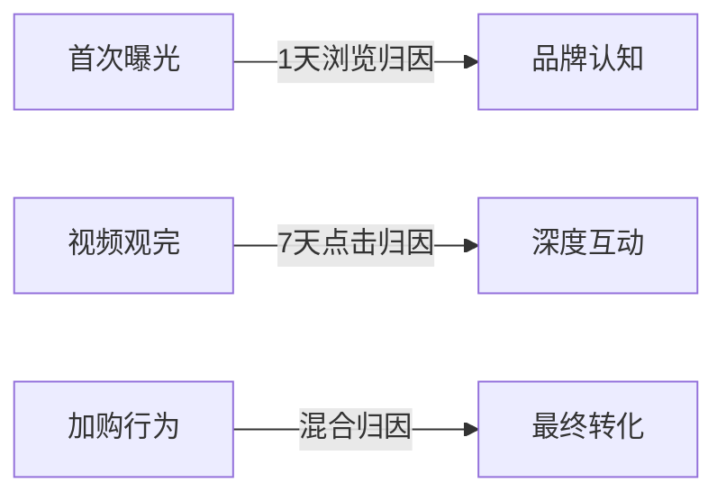

# Facebook广告内容动态优化全攻略

## 一、广告素材的"呼吸式"设计法则
**三维视觉呼吸系统**
- **基础层**：使用Canva建立9:16/1:1/4:5三款基础模板，确保主视觉焦点在屏幕黄金分割点（38.2%高度位置）
- **动态层**：植入可替换产品模块，每72小时轮换30%的画面元素（推荐Pexels实时趋势图库自动更新）
- **互动层**：在视频广告第8秒嵌入悬停按钮（如"长按获取秘籍"），提升15%互动率

**尺寸智能适配方案**
| 广告类型 | 核心参数 | 隐藏特性 | 增效技巧 |
|----------|----------|----------|---------|
| 信息流广告 | 1080×1080 | 支持3:4裁切 | 增加6个视觉停留点 |
| 快拍广告 | 1080×1920 | 自动适应安全框 | 顶部20%留白 |
| 轮播广告 | 1080×1080 | 可延伸至16:9 | 设置跨屏串联彩蛋 |

## 二、文案的脉冲式传播架构
**3秒触发机制**
- **痛点脉冲**：前3词必须包含数字+动词（如"50%女生忽视的防晒误区"）
- **信任脉冲**：6-8秒插入第三方认证标志（需通过Facebook品牌认证）
- **行动脉冲**：结尾嵌入动态CTA（"滑动领取→"）

**梯度版位适配表**
| 展示位置 | 文案密度 | 语气策略 | 符号规范 |
|----------|----------|----------|---------|
| Messenger | ≤18字符 | 亲密语气 | 多用💬符号 |
| Instagram动态 | 42字符内 | 悬念语气 | 添加🎯标签 |
| 右侧边栏 | 58字符 | 权威语气 | 附注★评级 |

## 三、受众的齿轮传动模型
**三级齿轮啮合策略**
- **冷启动齿轮**：基于LBS定位半径500米内相似店铺访客
- **温触达齿轮**：抓取点击落地页但未转化用户画像
- **热转化齿轮**：追踪购物车放弃用户+复购周期提醒

**动态归因补偿机制**

*建议安装Facebook Attribution配置跨渠道补偿规则*

## 四、智能版位的浪潮算法
**5G版位共振矩阵**
- **清晨流量浪**（6-9点）：侧重Messenger推送服务类广告
- **午间购物浪**（12-14点）：投放Marketplace折扣信息
- **晚间娱乐浪**（19-23点）：推送Instagram快拍挑战活动

**全渠道波动监测看板**
| 时段 | 核心指标 | 优化杠杆 |
|------|----------|---------|
| 峰值期 | CPC警戒值 | 智能出价+3% |
| 平缓期 | CTR基准线 | 扩大受众范围15% |
| 低谷期 | CVR阈值 | 切换低价版位组合 |

## 五、数据自愈型优化系统
**动态疲劳预警模型**
- **内容生命指数** = (点击率 × 0.3) + (停留时长 × 0.2) + (分享率 × 0.5)
- **当指数<65时触发**：自动从素材库调取替代方案，保留20%继承元素

**AI沙盒测试协议**
1. 同步运行3套算法引擎测试（贝叶斯/随机森林/深度学习）
2. 每12小时对比ROAS进展参数
3. 胜出算法获得未来24小时主导权

---

在广告疲劳周期不断缩短的现状下，动态优化系统的核心在于构建具备自我感知、自我诊断、自我修复能力的智能生态。通过将素材设计转化为可量化的呼吸频次、文案架构打造成脉冲触发器、受众定位升级为精密传动系统，广告主能突破传统优化天花板。配合新版位的智能浪潮算法和自愈型数据机制，最终实现广告内容从人工优化向机器进化的质变突破，在53亿次日活中持续捕获流动的商机。```
